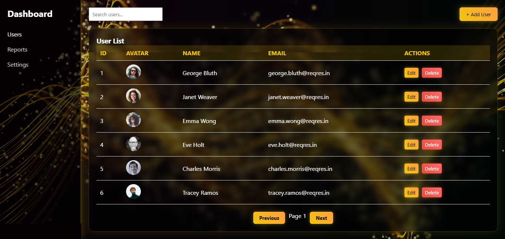
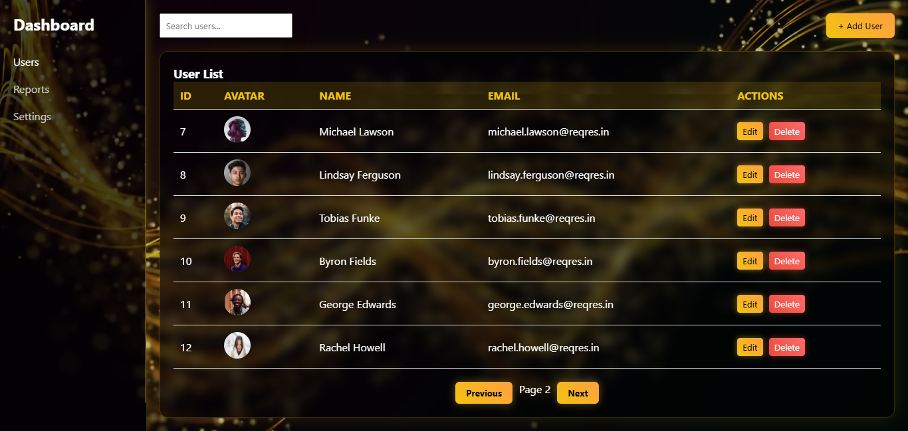

# 🖥️ User Management Dashboard

A **Multi-Feature User Management Dashboard** built using **HTML, CSS, and JavaScript (AJAX + REST API)**.  
This project demonstrates **CRUD operations** (Create, Read, Update, Delete) with a **real API** ([ReqRes](https://reqres.in)) and dynamic DOM updates **without page reloads**.

---

## 🚀 Features

1. **User List Display (GET)**  
   - Fetches paginated users from the ReqRes API.
   - Displays users in a responsive and styled table.
   - Pagination controls (Next/Previous) using AJAX.

2. **Add New User (POST)**
   - Add new users via a modal form.
   - Users are appended dynamically to the list.
   - LocalStorage is used to simulate persistent IDs.

3. **Edit Existing User (PUT)**
   - Edit user details via modal.
   - Updates user info dynamically in the UI.
   
4. **Delete User (DELETE)**
   - Delete any user with confirmation.
   - UI updates instantly without page reload.

5. **Search Users (Optional)**
   - Live search/filter by name or email.

6. **Additional Features**
   - Loading spinner during API calls.
   - Success and confirmation modals.
   - LocalStorage caching for faster reloads.
   - Background video with a **glassmorphism** dashboard UI.

---

## 🖼️ Screenshots

### Dashboard View


### Add / Edit User Modal


---

## 🛠️ Technologies Used

- **HTML5** + **CSS3** (Responsive + Glassmorphism UI)
- **JavaScript (Vanilla)**
- **Fetch API / AJAX**
- **LocalStorage** (for caching and ID simulation)
- **ReqRes API** for testing CRUD operations

---

## ⚡ How to Run Locally

1. Clone this repository:
   ```bash
   git clone https://github.com/JAWERIYAKHAN26/User-Dashboard.git
